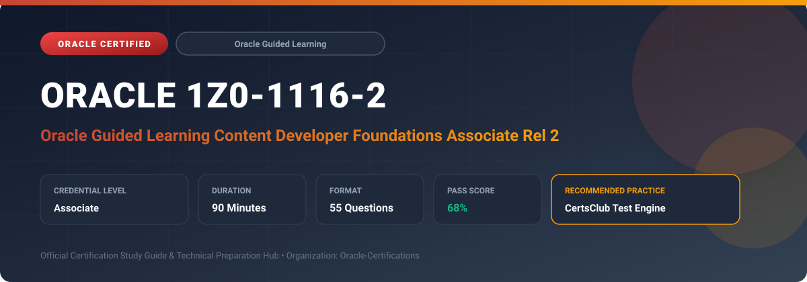

  

# Oracle 1Z0-1116-2: Oracle Guided Learning Content Developer Foundations Associate Rel 2

---

## 1. Exam Overview & Candidate Profile

The **Oracle 1Z0-1116-2: Oracle Guided Learning Content Developer Foundations Associate Rel 2** exam certifies specialists who develop in-application guidance, walkthroughs, and user adoption tools for Oracle Cloud Applications.

Candidates prove their ability to build step-by-step guides, smart tips, beacons, task lists, display conditions, multi-language localization, and user engagement analytics.

### Target Audience & Prerequisites
- **Target Roles**: Implementation Specialists, Cloud Architects, Technical Leads, Enterprise Consultants, and Systems Engineers.
- **Recommended Experience**: 1–2 years of practical, hands-on experience designing, implementing, and maintaining corresponding Oracle solutions.
- **Credential Earned**: Associate Certification.

---

## 2. Key Exam Specifications

| Specification | Details |
| :--- | :--- |
| **Exam Code** | **Oracle 1Z0-1116-2** |
| **Official Title** | Oracle Guided Learning Content Developer Foundations Associate Rel 2 |
| **Certification Track** | Oracle Guided Learning |
| **Exam Duration** | 90 Minutes |
| **Number of Questions** | 55 Questions |
| **Passing Score** | 68% |
| **Question Format** | Multiple Choice (Single/Multiple Answer), Scenario-Based Questions |
| **Delivery Provider** | Oracle University / Pearson VUE (Online Proctored or Test Center) |
| **Recommended Practice Engine** | [CertsClub Oracle Practice Tests](https://www.certsclub.com/oracle/1z0-1116-2-dumps.html) |

---

## 3. Official Blueprint & Exam Domain Breakdown

The examination assesses candidate competencies across core functional domains weighted as follows:

| Domain Area | Weighting |
| :--- | :--- |
| **Oracle Guided Learning (OGL) Architecture & Console** | `25%` |
| **Guide Types & Development (Process Guides, Beacons, Smart Tips)** | `25%` |
| **Targeting, Activation Conditions & Step Rules** | `20%` |
| **Content Publishing, Versioning & Deployment** | `15%` |
| **Analytics, Feedback Collection & User Adoption** | `15%` |

---

## 4. Deep Dive into Complex & Challenging Technical Topics

To secure a passing score on the 1Z0-1116-2 exam, candidates must master the following advanced concepts:

- Configuring the OGL Full Editor, selecting UI DOM elements, and creating reliable CSS selectors.
- Developing interactive Smart Walkthroughs, Callouts, Beacons, Task Lists, and Embedded Videos.
- Establishing display conditions based on user roles, page URLs, element visibility, and application variables.
- Managing multi-lingual translation packages and content export/import.
- Analyzing guide completion rates, drop-off points, and user satisfaction metrics.

---

## 5. Scenario-Based Demo & Practice Questions

### Question 1
Which Oracle Guided Learning (OGL) item type is designed to draw immediate visual attention to a specific new button or field on a Fusion screen without interrupting the user's workflow?

A) Beacon
B) Full Screen Modal
C) Process Walkthrough
D) Feedback Survey

- **Correct Answer**: `A) Beacon`  
- **Technical Explanation**: Beacons are subtle animated indicators placed adjacent to specific UI elements to highlight new features or important fields without disrupting user navigation.

---

### Question 2
What selector method should an OGL content developer prioritize when anchoring a walkthrough step to an application field to ensure resilience against application updates?

A) Stable HTML IDs or Data Test IDs
B) Absolute DOM Path (/html/body/div[3]/form/input[2])
C) Volatile random class names
D) Screen pixel coordinates

- **Correct Answer**: `A) Stable HTML IDs or Data Test IDs`  
- **Technical Explanation**: Targeting unique, stable identifiers like data-test-id or element IDs ensures that guided learning steps remain functional even if page layouts shift during software updates.

---

## 6. Recommended Preparation Strategy & Practice Testing Engine

Achieving certification in **Oracle 1Z0-1116-2** requires balanced theoretical study and scenario-based simulation practice:

1. **Review Oracle Documentation**: Master architecture guides, implementation workbooks, and administration manuals on the Oracle Help Center.
2. **Hands-on Lab Practice**: Execute real-world configuration, policy setup, and troubleshooting tasks in your cloud tenancy or test instance.
3. **Simulated Exam Drills**: Practice answering timed, scenario-based multiple-choice questions to familiarize yourself with the question formats, traps, and timing constraints.

### Practice With CertsClub
For realistic practice questions, updated dumps, and mock testing environments:
- **Resource**: [CertsClub Oracle Practice Test Engine](https://www.certsclub.com/oracle/1z0-1116-2-dumps.html)
- **Special Discount**: Use coupon code **`club20`** during checkout for an instant **20% discount** on all practice exam bundles and testing engines.

---

## 7. Official Documentation & References

- [Oracle University Certification Registry](https://education.oracle.com/)
- [Oracle Help Center Documentation Portal](https://docs.oracle.com/)
- [Oracle Cloud Infrastructure & Applications Guides](https://docs.oracle.com/en/cloud/)
- [CertsClub Oracle Certification Exam Practice](https://www.certsclub.com/oracle/1z0-1116-2-dumps.html)

---

## 8. SEO & Discovery Keywords

`oracle 1z0-1116-2, oracle 1z0-1116-2 exam, oracle 1z0-1116-2 dumps, 1Z0-1116-2 practice questions, 1Z0-1116-2 study guide, oracle guided learning content developer foundations associate rel 2, certsclub 1z0-1116-2`